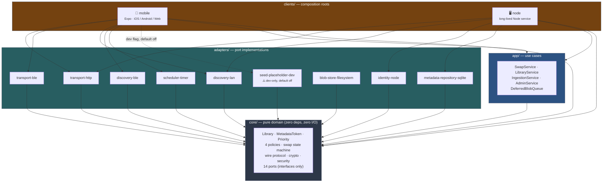
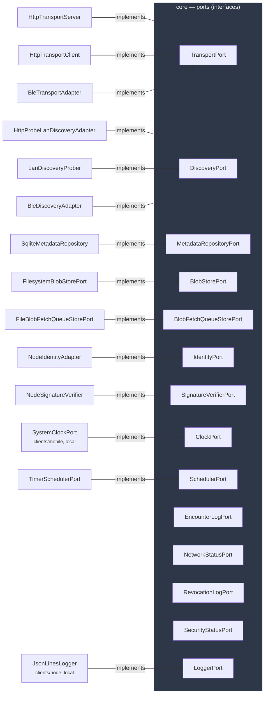

# Dependency graph

Generated from the actual workspace `package.json` files and `implements` clauses on
`main` — not hand-drawn from memory. Companion to [`../adr/0001-hexagonal-architecture.md`](../adr/0001-hexagonal-architecture.md),
which explains *why* the codebase is shaped this way; this doc shows *what it actually
looks like* right now.

## 1. Workspace dependency graph

Every arrow means "depends on" (imports from). The one rule this diagram exists to make
checkable at a glance: **nothing points into `core`** except `app` and the adapters —
and `core` itself points at nothing.



Note `blob-store-filesystem` has no client wired to it yet — `DeferredBlobQueue` (in
`app/`) is built and tested against the in-memory `BlobStorePort` fake, but no
composition root instantiates the real filesystem adapter yet. That's a real gap, not
a diagramming error.

## 2. Ports and their adapters

`core` owns 14 port interfaces and depends on none of their implementations — this is
the actual hexagonal boundary, and it's a more useful picture of "what talks to what"
than the package graph above. Ports with no adapter row only have an in-memory fake
(`core/src/ports/fakes/`); nothing outside tests has wired a real implementation yet.



`EncounterLogPort`, `NetworkStatusPort`, `RevocationLogPort`, and `SecurityStatusPort`
currently have only in-memory fakes — no real adapter package exists for any of them
yet. That's true today; check `core/src/ports/fakes/index.ts` against the list above
before trusting this note on a future read.

## 3. How to keep this diagram honest

Both diagrams above were built by actually reading every workspace `package.json`'s
`dependencies` and grepping for `implements \w+Port` across `adapters/` and `clients/`
— not transcribed from the PR history. If you add a package or a port implementation,
regenerate rather than hand-edit:

```bash
# package-level deps
for f in core app adapters/*/package.json clients/*/package.json; do :; done
node -e "const fs=require('fs'); for (const dir of [...fs.readdirSync('adapters').map(d=>'adapters/'+d), ...fs.readdirSync('clients').map(d=>'clients/'+d), 'core', 'app']) { try { const p=JSON.parse(fs.readFileSync(dir+'/package.json')); console.log(p.name, '->', Object.keys(p.dependencies||{}).filter(d=>d.startsWith('@art-pollinator/')).join(', ')); } catch {} }"

# port implementations
grep -rn "implements [A-Za-z]*Port" adapters/*/src/*.ts clients/*/src/**/*.ts | grep -v test
```
