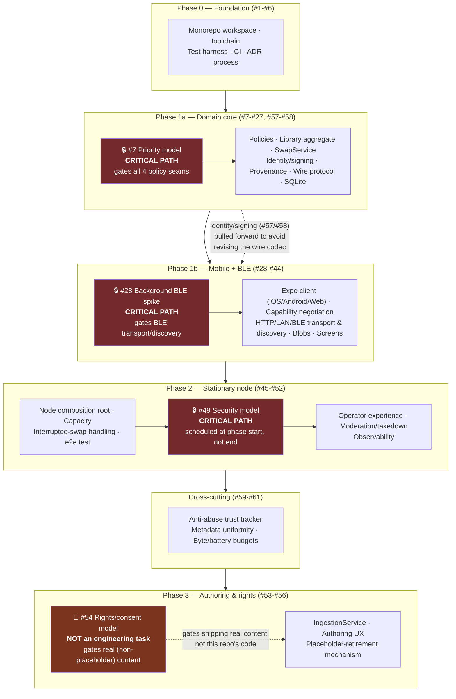

# Roadmap: phases, gates, and how it was actually built

`IMPLEMENTATION.md` lays out the plan as an ordered list with a "critical path" table.
This is the same plan as a picture, plus — since it's now historical fact, not just a
plan — the actual batch/PR record of how `main` got here.

## 1. Phase structure and critical-path gates

The three critical-path gates (red) are exactly `IMPLEMENTATION.md`'s own table: a
node/policy/security decision each later batch reads an ordering or a trust boundary
that nothing else defines. `#54` (dark orange) is a different kind of gate — not a
technical blocker but an explicit "an AI agent cannot resolve this" boundary
(`AGENTS.md` §3) — see `docs/rights/consent-model-DRAFT.md`.

## 2. As-built: batch → PR → what shipped

All 61 issues closed across 12 batches and 15 merged PRs. Four PRs made a
judgment call significant enough to flag in its own description rather than bury —
marked ⚠️ below; see each PR/ADR for the reasoning.

| Batch | PR | Issues closed | Headline |
| --- | --- | --- | --- |
| 1 | [#64](https://github.com/Luan-vP/art-pollinator/pull/64) | #1–#6 | Monorepo, toolchain, CI, ADR process |
| 2 | [#65](https://github.com/Luan-vP/art-pollinator/pull/65) | #7, #8, #9, #10, #11, #17 | Priority model, `MetadataToken`, `Library`, all 8 ports |
| 3 | [#66](https://github.com/Luan-vP/art-pollinator/pull/66) | #12, #13, #14, #15, #18 | Policy seams, contract suite, in-memory fakes |
| 4 | [#67](https://github.com/Luan-vP/art-pollinator/pull/67) | #16, #19, #20 | Swap state machine, `SwapService`, encounter memory |
| 5 | [#68](https://github.com/Luan-vP/art-pollinator/pull/68) | #21, #22, #23, #24, #57, #58 | ⚠️ Identity/signing, **provenance hop-count-only (ADR-0007)**, wire codec |
| 6 | [#69](https://github.com/Luan-vP/art-pollinator/pull/69) | #25, #26, #27 | SQLite repository adapter, migrations |
| 7 | [#70](https://github.com/Luan-vP/art-pollinator/pull/70) | #28–#32 | ⚠️ BLE spike — **`react-native-ble-plx` can't advertise (ADR-0010)** |
| 8 | [#71](https://github.com/Luan-vP/art-pollinator/pull/71) | #33, #34, #35, #36, #43, #44 | ⚠️ HTTP/LAN/BLE adapters — **`munim-bluetooth` chosen for advertising (ADR-0011)** |
| 9 | [#72](https://github.com/Luan-vP/art-pollinator/pull/72) | #37–#42 | Composition root wiring, screens, blob storage, placeholder seed |
| 10a | [#73](https://github.com/Luan-vP/art-pollinator/pull/73) | #45, #46, #47, #48 | Node server foundation, capacity, interrupted-swap, e2e test |
| 10b | [#74](https://github.com/Luan-vP/art-pollinator/pull/74) | #49, #50, #51, #52 | ⚠️ Security model — **auth handshake + opt-in TLS (ADR-0013/0014)**, moderation, observability |
| 11 | [#75](https://github.com/Luan-vP/art-pollinator/pull/75) | #59, #60, #61 | ⚠️ Anti-abuse — **trust tracker scoped to node identities only (ADR-0017)** |
| 12 | [#76](https://github.com/Luan-vP/art-pollinator/pull/76) | #53, #54, #55, #56 | ⚠️ Ingestion/authoring — **rights model kept as an explicit draft**, retirement mechanism left inactive |
| — | [#77](https://github.com/Luan-vP/art-pollinator/pull/77) | — | Architecture dependency-graph diagrams |

## 3. Reading this against `IMPLEMENTATION.md`

- The plan's Phase 2 transport adapters ("pulled forward into 1b") and identity work
  ("should start during Phase 1a") both happened exactly where the plan said they
  should — batches 5 and 8 above.
- Phase 2 was split into two PRs (10a/10b) specifically so the security model — the
  plan's third critical-path gate — got a dedicated review pass rather than being
  folded into general node-server plumbing.
- Nothing in Phase 3 flips the placeholder-content switch live. `#56`'s retirement
  *mechanism* exists and is tested; `PLACEHOLDER_CONTENT_RETIRED` still defaults to
  `false`, and stays that way until a real (non-draft) consent process exists.
