# Security pipeline

The layered defense an incoming connection and its offered content actually pass
through, per `docs/security/threat-model.md` and the code in
`adapters/transport-http/src/http-transport-server.ts`,
`core/src/security/{peer-auth,rate-limiter,ingest-validation,trust-tracker}.ts`, and
`app/src/swap/swap-service.ts`. This is the "what gates what, and in order" view —
[`swap-flow.md`](./swap-flow.md) shows the same territory as a conversation between
two devices; this shows it as a single connection's obstacle course.

```mermaid
flowchart TD
    conn(["Incoming HTTP connection"]) --> hsCheck{"security config<br/>present? (ADR-0013)"}
    hsCheck -- "no" --> messages["/messages<br/><small>unauthenticated</small>"]
    hsCheck -- "yes" --> challenge["POST /handshake/challenge<br/><small>per-IP rate limited</small>"]
    challenge --> response["POST /handshake/response<br/><small>{publicKey, signature(nonce)}</small>"]
    response --> verify{"verifyChallengeResponse()"}
    verify -- invalid --> reject401(["401 rejected"])
    verify -- valid --> session["Session established<br/><small>TTL-bounded</small>"]
    session --> messages

    messages --> swapRL{"swapRateLimiter<br/><small>per peer id, sliding window</small>"}
    swapRL -- exceeded --> abortThrottle(["Abort swap<br/><small>trustTracker: throttled<br/>(node peers only)</small>"])
    swapRL -- ok --> revocationRound["Exchange + apply<br/>revocation round (#51)"]

    revocationRound --> offerIn["Inbound offer received"]
    offerIn --> sizeCheck{"validateOfferItems()<br/><small>size / count</small>"}
    sizeCheck -- "whole offer<br/>implausibly large" --> abortSize(["Abort swap"])
    sizeCheck -- "some items<br/>oversized" --> trustPenalty1["trustTracker:<br/>rejectedContent"]
    sizeCheck -- ok --> sigCheck{"partitionBySignature()"}
    trustPenalty1 --> sigCheck
    sigCheck -- "unsigned /<br/>tampered" --> trustPenalty2["trustTracker:<br/>rejectedContent"]
    sigCheck -- verified --> revokedFilter["Drop already-known-<br/>revoked content hashes"]
    trustPenalty2 --> revokedFilter

    revokedFilter --> trustAdjust["Trust-adjusted AcceptPolicy<br/><small>createTrustAdjustedAcceptPolicy()<br/>node peers only, ADR-0017</small>"]
    trustAdjust --> accept["AcceptPolicy.selectAccept()"]
    accept --> repo[("MetadataRepositoryPort<br/>+ Library (slot + byte budget)")]

    style abortThrottle fill:#742a2a,color:#fff,stroke:#9b2c2c
    style abortSize fill:#742a2a,color:#fff,stroke:#9b2c2c
    style reject401 fill:#742a2a,color:#fff,stroke:#9b2c2c
    style trustPenalty1 fill:#7b341e,color:#fff,stroke:#9c4221
    style trustPenalty2 fill:#7b341e,color:#fff,stroke:#9c4221
    style repo fill:#22543d,color:#fff,stroke:#2f855a
```

## Two things this diagram deliberately keeps separate

**Authentication answers "who are you"; the rate limiter and trust tracker answer
"should I still talk to you."** A connection can pass the handshake (present *some*
valid signature — even a freshly-minted rotating identity, per SPEC.md §7) and still
get throttled or trust-penalized on every subsequent swap attempt. The handshake is a
one-time gate per session; rate limiting and trust adjustment apply continuously,
per swap.

**Trust tracking is scoped to node identities only** (`peer.kind === "node"`), never
`"person"` — the boolean gate documented in `docs/adr/0017-trust-tracker-scoped-to-node-identities.md`.
A node's identity is persistent by design (SPEC.md §4); a person's is designed to
rotate (SPEC.md §7), so accumulating a long-lived reputation score keyed by a
person's identity would quietly reintroduce the exact peer-scoped tracking problem
the project already ruled out for encounter memory (SPEC.md §6.4/§7,
`core/src/encounter/encounter-memory.ts`). This diagram's `trustTracker` boxes only
ever fire on the node branch — the residual risk (Sybil-minted node identities can
still evade an identity-keyed limiter) is named explicitly in
`docs/security/threat-model.md` and mitigated by the IP-keyed handshake limiter above
it, which costs an attacker a real TCP connection per attempt rather than a free
Ed25519 keypair.
