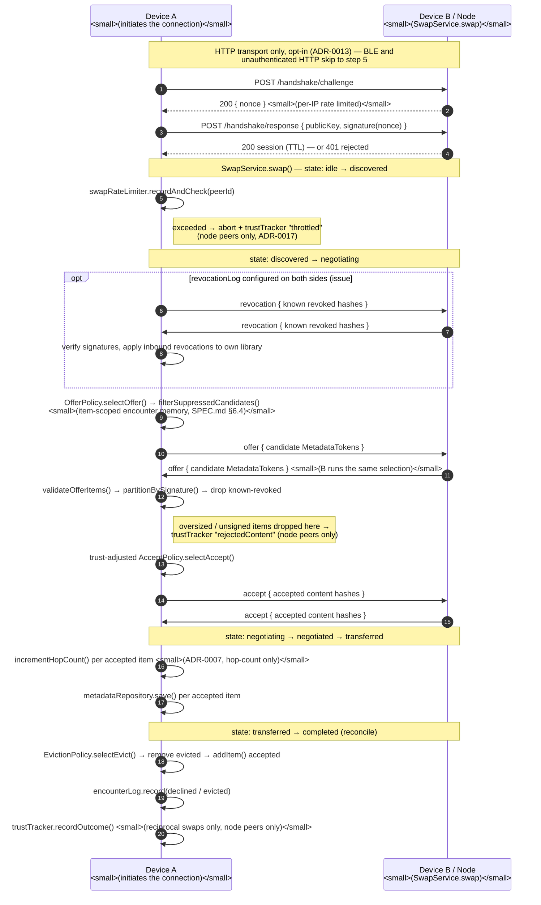
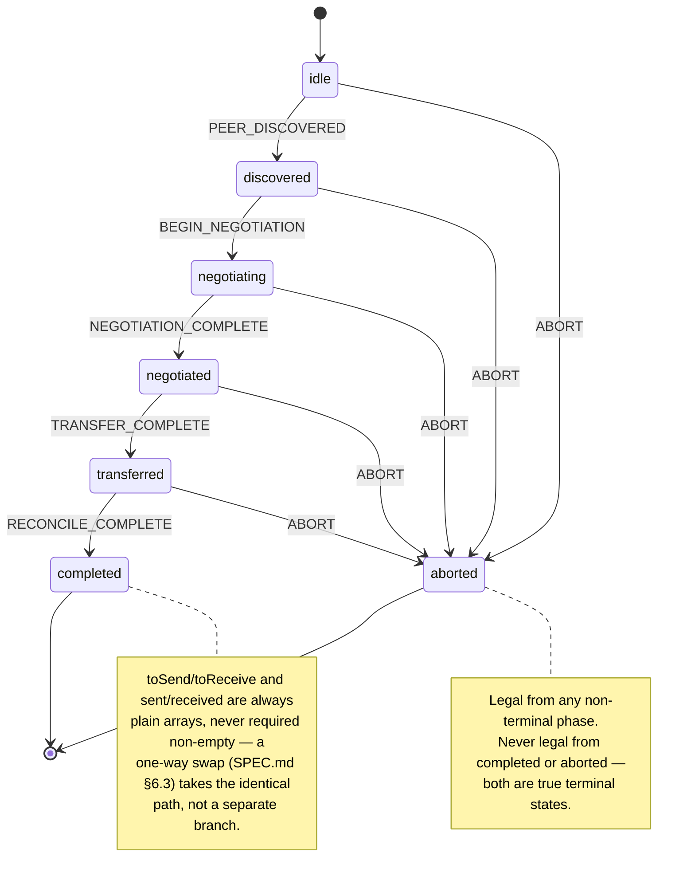

# Swap flow

The two pictures `SPEC.md` §6.2 describes in prose — "discover a peer → exchange
tokens → negotiate → transfer → reconcile" — and what `SwapService`
(`app/src/swap/swap-service.ts`) and the swap state machine
(`core/src/swap/swap-state-machine.ts`) actually do. Both diagrams were built by
reading those two files line by line, not from the spec alone — where the code adds
detail the spec doesn't (rate limiting, revocation, trust adjustment), it's shown here.

## 1. One swap, end to end

Drawn from Device A's perspective; Device B runs the identical logic symmetrically.
Steps 1–4 (the HTTP auth handshake) only happen when the peer is a node with
`security` configured (`ADR-0013`) — BLE and unauthenticated HTTP skip straight to the
rate-limit check.

**Any step failing — a timeout, a transport error, a malformed message — throws
`SwapAbortedError` and drives the state machine's `ABORT` event from wherever it
currently sits** (issue #47). Because the repository write only happens after both
negotiation round trips fully resolve, an abort during negotiation always precedes any
write — there's no code path that leaves a half-written token.

## 2. The state machine underneath

`core/src/swap/swap-state-machine.ts`'s actual states and transitions — a pure
`transition(state, event)` reducer, never a class, so every case above is just an
assertion on a returned value.

## Notes on reading this against the code

- The sequence diagram compresses "A does X, B does the same" into one arrow where the
  logic is symmetric (e.g. both sides run `OfferPolicy.selectOffer` independently) —
  the code doesn't have a single shared "negotiation" step, each side computes its own.
- `revocationLog`, `signatureVerifier`, `swapRateLimiter`, and `trustTracker` are all
  optional constructor dependencies on `SwapService` (`SwapServiceDeps`). Every "opt"
  block and trust-tracker line above is skipped entirely when the corresponding
  dependency isn't wired in — this diagram shows the fully-configured node path, which
  is what `clients/node`'s composition root actually wires.
- Trust tracking is deliberately scoped to `peer.kind === "node"` only, never
  `"person"` — see `docs/adr/0017-trust-tracker-scoped-to-node-identities.md` and the
  [security pipeline](./security-pipeline.md) doc for why.
